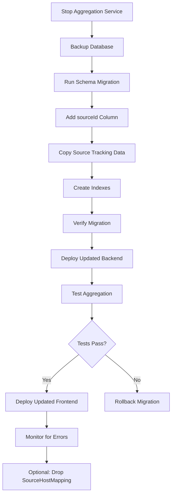

# Implementation Plan: Eliminate SourceHostMapping for Direct Host Storage with Deduplication

## Executive Summary

This document outlines a comprehensive implementation plan to eliminate the `SourceHostMapping` table and its associated foreign key constraint violations (P2003). The current architecture creates race conditions when sources are deleted during aggregation, causing failures across multiple domains including metrics.aerografodiscount.it/pt/be/ch/fr, wk.aeropetarlies.com, aeroplanesomewhat.com, and 18plus.info.

**Proposed Solution:** Store hosts directly with an optional `sourceId` field and use database `DISTINCT` queries to deduplicate hosts when reading. This eliminates the many-to-many relationship and removes the foreign key dependency that causes the race condition.

**Benefits:**
- Eliminates P2003 foreign key constraint violations
- Simplifies data model from three-table to two-table relationship
- Reduces query complexity for host retrieval
- Maintains source tracking capability through optional `sourceId` field
- Improves aggregation performance by removing join operations

---

## Technical Approach

### Current Architecture

```
Sources → SourceHostMapping (many-to-many) → Hosts
         ↓
    Foreign Key Dependencies
         ↓
    Race Condition on Delete
```

**Problem Flow:**
1. Aggregation service creates `SourceHostMapping` entries during processing
2. If a source is deleted while aggregation is running
3. Prisma attempts to cascade delete related mappings
4. Concurrent aggregation operations cause foreign key constraint violations (P2003)

### Proposed Architecture

```
Sources → Hosts (direct, with optional sourceId)
         ↓
    DISTINCT Query for Deduplication
         ↓
    Unique Hosts View
```

**Solution Flow:**
1. Hosts are stored directly with optional `sourceId` for tracking
2. No intermediate mapping table means no foreign key dependencies
3. Deduplication happens at read time using database `DISTINCT` queries
4. Source tracking maintained through optional `sourceId` field on HostEntry

### Data Model Changes

```prisma
// Current: SourceHostMapping (to be removed)
model SourceHostMapping {
  id          String    @id @default(cuid())
  sourceId    String
  hostEntryId String
  // ... other fields
}

// Proposed: Add sourceId to HostEntry (optional)
model HostEntry {
  id               String              @id @default(cuid())
  domain           String              @unique
  normalized       String              @unique
  entryType        String              @default("block")
  enabled          Boolean             @default(true)
  firstSeen        DateTime            @default(now())
  lastSeen         DateTime            @updatedAt
  occurrenceCount  Int                 @default(1)
  sourceId         String?             // NEW: Optional source tracking
  // Remove sourceMappings relation
}
```

---

## Step-by-Step Implementation

### Phase 1: Database Schema Changes

#### 1.1 Modify Prisma Schema

**File:** [`backend/prisma/schema.prisma`](backend/prisma/schema.prisma)

**Changes:**

1. **Add `sourceId` field to `HostEntry` model** (after `occurrenceCount`):
   ```prisma
   model HostEntry {
     // ... existing fields
     occurrenceCount  Int                 @default(1)
     sourceId         String?             // NEW: Optional source tracking
     // Remove sourceMappings relation
   }
   ```

2. **Remove `sourceMappings` relation from `HostEntry`**:
   ```prisma
   // REMOVE this line:
     sourceMappings   SourceHostMapping[]
   ```

3. **Remove `hostMappings` relation from `Source` model**:
   ```prisma
   // REMOVE this line:
     hostMappings       SourceHostMapping[]
   ```

4. **Option A: Keep SourceHostMapping temporarily for migration** (recommended):
   - Keep the model but mark it as deprecated
   - Add comment indicating it will be removed

5. **Option B: Remove SourceHostMapping entirely** (after data migration):
   - Drop the table in migration
   - Remove the model from schema

#### 1.2 Create Migration Script

**File:** [`backend/prisma/migrations/<timestamp>_add_source_id_to_host_entry/`](backend/prisma/migrations/)

**Migration SQL:**
```sql
-- Add sourceId column to host_entries
ALTER TABLE "host_entries" ADD COLUMN "sourceId" TEXT;

-- Create index for sourceId queries
CREATE INDEX "host_entries_sourceId_idx" ON "host_entries"("sourceId");

-- Copy existing source tracking data (if keeping SourceHostMapping temporarily)
-- This will be done in the migration service

-- Optional: Drop source_host_mappings table after successful migration
-- DROP TABLE IF EXISTS "source_host_mappings";
```

---

### Phase 2: Backend Service Changes

#### 2.1 Update Aggregation Service

**File:** [`backend/src/services/aggregation.service.ts`](backend/src/services/aggregation.service.ts)

**Changes in [`storeSourceEntries()`](backend/src/services/aggregation.service.ts:404):**

**Current Code (lines 404-461):**
```typescript
private async storeSourceEntries(sourceId: string, entries: ParsedEntry[]): Promise<void> {
  // Update entry count in source content
  await prisma.sourceContent.updateMany({
    where: { sourceId },
    data: { entryCount: entries.length }
  });

  // Process each entry and create host mappings
  for (const entry of entries) {
    const normalized = entry.domain.toLowerCase().trim();

    try {
      // Upsert host entry
      const hostEntry = await prisma.hostEntry.upsert({
        where: { normalized },
        update: {
          lastSeen: new Date(),
          occurrenceCount: { increment: 1 }
        },
        create: {
          domain: entry.domain,
          normalized,
          entryType: entry.type,
          firstSeen: new Date(),
          lastSeen: new Date(),
          occurrenceCount: 1
        }
      });

      // Create or update source-host mapping
      await prisma.sourceHostMapping.upsert({
        where: {
          sourceId_hostEntryId: {
            sourceId,
            hostEntryId: hostEntry.id
          }
        },
        update: {
          lastSeen: new Date(),
          lineNumber: entry.lineNumber,
          rawLine: entry.comment || null
        },
        create: {
          sourceId,
          hostEntryId: hostEntry.id,
          lineNumber: entry.lineNumber,
          rawLine: entry.comment || null,
          comment: entry.comment || null,
          firstSeen: new Date(),
          lastSeen: new Date()
        }
      });
    } catch (error) {
      // Log but don't fail - source might have been deleted
      logger.warn(`Could not store entry for domain ${entry.domain}:`, error);
    }
  }
}
```

**New Code:**
```typescript
private async storeSourceEntries(sourceId: string, entries: ParsedEntry[]): Promise<void> {
  // Update entry count in source content
  await prisma.sourceContent.updateMany({
    where: { sourceId },
    data: { entryCount: entries.length }
  });

  // Process each entry and store host directly
  for (const entry of entries) {
    const normalized = entry.domain.toLowerCase().trim();

    try {
      // Upsert host entry with sourceId for tracking
      await prisma.hostEntry.upsert({
        where: { normalized },
        update: {
          lastSeen: new Date(),
          occurrenceCount: { increment: 1 },
          // Update sourceId only if not already set (preserve first source)
          sourceId: prisma.hostEntry.fields.sourceId === null ? sourceId : undefined
        },
        create: {
          domain: entry.domain,
          normalized,
          entryType: entry.type,
          firstSeen: new Date(),
          lastSeen: new Date(),
          occurrenceCount: 1,
          sourceId: sourceId  // Store source for tracking
        }
      });
    } catch (error) {
      // Log but don't fail - source might have been deleted
      logger.warn(`Could not store entry for domain ${entry.domain}:`, error);
    }
  }
}
```

**Note:** Prisma doesn't support conditional updates like `fields.sourceId === null`. The actual implementation will need to:
1. First check if the host entry exists
2. If not, create with sourceId
3. If exists, update without changing sourceId (preserve first source)

#### 2.2 Update Hosts Controller

**File:** [`backend/src/controllers/hosts.controller.ts`](backend/src/controllers/hosts.controller.ts)

**Changes in [`getAllHosts()`](backend/src/controllers/hosts.controller.ts:19):**

**Current Code (lines 42-48):**
```typescript
if (sourceId) {
  where.sourceMappings = {
    some: {
      sourceId
    }
  };
}
```

**New Code:**
```typescript
if (sourceId) {
  where.sourceId = sourceId;
}
```

**Changes in [`getAllHosts()` include section](backend/src/controllers/hosts.controller.ts:59-71):**

**Current Code (lines 59-71):**
```typescript
include: {
  sourceMappings: {
    include: {
      source: {
        select: {
          id: true,
          name: true,
          enabled: true
        }
      }
    }
  }
}
```

**New Code:**
```typescript
include: {
  source: {
    select: {
      id: true,
      name: true,
      enabled: true
    }
  }
}
```

**Changes in [`getHostById()`](backend/src/controllers/hosts.controller.ts:115):**

**Current Code (lines 121-134):**
```typescript
include: {
  sourceMappings: {
    include: {
      source: {
        select: {
          id: true,
          name: true,
          type: true,
          enabled: true
        }
      }
    }
  }
}
```

**New Code:**
```typescript
include: {
  source: {
    select: {
      id: true,
      name: true,
      type: true,
      enabled: true
    }
  }
}
```

**Changes in [`getHostStats()`](backend/src/controllers/hosts.controller.ts:314):**

**Current Code (lines 337-366):**
```typescript
// Get counts by source
const sourceCounts = await prisma.sourceHostMapping.groupBy({
  by: ['sourceId'],
  _count: {
    hostEntryId: true
  }
});
```

**New Code:**
```typescript
// Get counts by source using sourceId on HostEntry
const sourceCounts = await prisma.hostEntry.groupBy({
  by: ['sourceId'],
  _count: {
    id: true
  },
  where: {
    sourceId: {
      not: null
    }
  }
});
```

**Remove or Update Mapping Toggle Endpoints:**

The following endpoints rely on `SourceHostMapping` and need to be removed or updated:

1. [`toggleSourceHostMapping()`](backend/src/controllers/hosts.controller.ts:394) - REMOVE
2. [`bulkUpdateSourceHostMappings()`](backend/src/controllers/hosts.controller.ts:450) - REMOVE

**Routes to Remove:**

**File:** [`backend/src/routes/hosts.ts`](backend/src/routes/hosts.ts)

```typescript
// REMOVE these routes:
router.patch('/:hostId/sources/:sourceId', hostsController.toggleSourceHostMapping.bind(hostsController));
router.patch('/:hostId/sources/bulk', hostsController.bulkUpdateSourceHostMappings.bind(hostsController));
```

#### 2.3 Update TypeScript Types

**File:** [`backend/src/types/index.ts`](backend/src/types/index.ts)

**Changes:**

1. **Update `HostEntry` interface** (lines 52-60):
```typescript
export interface HostEntry {
  id: string;
  domain: string;
  normalized: string;
  entryType: 'block' | 'allow' | 'element';
  firstSeen: Date;
  lastSeen: Date;
  occurrenceCount: number;
  sourceId?: string;  // NEW: Optional source tracking
}
```

2. **Remove `SourceHostMapping` interface** (lines 62-71) - or mark as deprecated

---

### Phase 3: Frontend Changes

#### 3.1 Update Host Types

**File:** [`frontend/src/types/index.ts`](frontend/src/types/index.ts)

**Changes:**

1. **Update `HostEntry` interface** (lines 46-56):
```typescript
export interface HostEntry {
  id: string
  domain: string
  normalized: string
  entryType: 'block' | 'allow' | 'element'
  enabled: boolean
  occurrenceCount: number
  firstSeen: string
  lastSeen: string
  source?: HostSource  // CHANGED: Now direct relation instead of array
}
```

2. **Update `HostSource` interface** (lines 58-67):
```typescript
export interface HostSource {
  id: string
  name: string
  type: string
  enabled: boolean
  // Remove mapping-specific fields
}
```

3. **Remove or update `HostStats` interface** (lines 79-93):
```typescript
export interface HostStats {
  total: number
  enabled: number
  disabled: number
  byEntryType: {
    block: number
    allow: number
    element: number
  }
  bySource: Array<{
    sourceId: string
    sourceName: string
    hostCount: number
  }>
}
```

#### 3.2 Update Hosts Hook

**File:** [`frontend/src/hooks/useHosts.ts`](frontend/src/hooks/useHosts.ts)

**Changes in [`buildQueryString()`](frontend/src/hooks/useHosts.ts:15):**

The `sourceId` parameter remains the same but now filters directly on `sourceId` field.

**Changes in response formatting** (around line 75):

**Current Code:**
```typescript
const formattedHosts = hosts.map(host => ({
  id: host.id,
  domain: host.domain,
  entryType: host.entryType,
  enabled: host.enabled,
  occurrenceCount: host.occurrenceCount,
  firstSeen: host.firstSeen.toISOString(),
  lastSeen: host.lastSeen.toISOString(),
  sources: host.sourceMappings.map(mapping => ({
    id: mapping.source.id,
    name: mapping.source.name,
    enabled: mapping.source.enabled,
    mappingEnabled: mapping.enabled
  }))
}));
```

**New Code:**
```typescript
const formattedHosts = hosts.map(host => ({
  id: host.id,
  domain: host.domain,
  entryType: host.entryType,
  enabled: host.enabled,
  occurrenceCount: host.occurrenceCount,
  firstSeen: host.firstSeen.toISOString(),
  lastSeen: host.lastSeen.toISOString(),
  source: host.source ? {
    id: host.source.id,
    name: host.source.name,
    enabled: host.source.enabled,
    type: 'unknown'  // Add type if needed
  } : null
}));
```

#### 3.3 Update Hosts Table Component

**File:** [`frontend/src/components/hosts/HostsTable.tsx`](frontend/src/components/hosts/HostsTable.tsx)

**Changes in sources column rendering** (around line 143):

**Current Code:**
```typescript
<div className="col-span-2 text-center">
  <span className="text-sm">{host.sources.length}</span>
</div>
```

**New Code:**
```typescript
<div className="col-span-2 text-center">
  <span className="text-sm">{host.source ? '1' : '0'}</span>
</div>
```

#### 3.4 Update Hosts Route

**File:** [`frontend/src/routes/Hosts.tsx`](frontend/src/routes/Hosts.tsx)

**No major changes required** - the component already handles the data structure generically. May need minor adjustments if displaying source information directly.

---

### Phase 4: Database Migration Strategy

#### 4.1 Pre-Migration Checklist

- [ ] Backup current database
- [ ] Stop all running aggregation services
- [ ] Notify users of planned maintenance window
- [ ] Ensure no active source deletion operations

#### 4.2 Migration Steps

**Step 1: Add new column**
```sql
ALTER TABLE "host_entries" ADD COLUMN "sourceId" TEXT REFERENCES "sources"(id);
```

**Step 2: Populate sourceId from existing mappings**
```sql
-- Copy sourceId from SourceHostMapping to HostEntry
UPDATE "host_entries"
SET "sourceId" = (
  SELECT "sourceId" 
  FROM "source_host_mappings" 
  WHERE "source_host_mappings"."hostEntryId" = "host_entries".id
  LIMIT 1
)
WHERE EXISTS (
  SELECT 1 
  FROM "source_host_mappings" 
  WHERE "source_host_mappings"."hostEntryId" = "host_entries".id
);
```

**Step 3: Create index for performance**
```sql
CREATE INDEX "host_entries_sourceId_idx" ON "host_entries"("sourceId");
```

**Step 4: Verify migration**
```sql
-- Check that all hosts with mappings have sourceId
SELECT COUNT(*) as total,
       COUNT("sourceId") as with_source
FROM "host_entries"
WHERE EXISTS (
  SELECT 1 FROM "source_host_mappings" 
  WHERE "source_host_mappings"."hostEntryId" = "host_entries".id
);
```

**Step 5: Optional - Drop SourceHostMapping table**
```sql
-- Only after verifying all applications are updated
DROP TABLE IF EXISTS "source_host_mappings";
```

#### 4.3 Rollback Plan

**If issues arise:**

1. **Quick Rollback (within migration window):**
   ```sql
   -- Restore from backup
   RESTORE DATABASE FROM backup_pre_dedup;
   ```

2. **Delayed Rollback (after deployment):**
   - Keep SourceHostMapping table during transition
   - Run dual-read approach (check both tables)
   - Gradually migrate traffic to new approach
   - Remove old table after verification

---

### Phase 5: Testing Strategy

#### 5.1 Unit Tests

**Aggregation Service Tests:**
- [`backend/src/services/aggregation.service.spec.ts`](backend/src/services/aggregation.service.spec.ts)
- Test `storeSourceEntries()` with new direct storage
- Test deduplication logic
- Test source tracking preservation

**Hosts Controller Tests:**
- [`backend/src/controllers/hosts.controller.spec.ts`](backend/src/controllers/hosts.controller.spec.ts)
- Test `getAllHosts()` with new query structure
- Test `getHostStats()` with new grouping logic
- Test removed endpoints return 404

#### 5.2 Integration Tests

**API Endpoint Tests:**
- `GET /api/hosts` - Verify pagination and filtering work
- `GET /api/hosts/:id` - Verify single host retrieval
- `GET /api/hosts/stats` - Verify stats calculation
- `POST /api/aggregate` - Verify aggregation completes without errors

**Database Tests:**
- Verify no foreign key constraint violations during aggregation
- Verify sourceId is correctly populated
- Verify deduplication works correctly

#### 5.3 Frontend Tests

**Component Tests:**
- Hosts table displays correctly with new data structure
- Source filtering works with new query parameter
- Stats display correctly

**E2E Tests:**
- Complete aggregation workflow
- Hosts page loading and interaction
- Source deletion during aggregation (verify no errors)

---

## Code Changes Summary

### Files to Modify

| File | Changes |
|------|---------|
| [`backend/prisma/schema.prisma`](backend/prisma/schema.prisma) | Add sourceId to HostEntry, remove SourceHostMapping relations |
| [`backend/src/services/aggregation.service.ts`](backend/src/services/aggregation.service.ts) | Remove SourceHostMapping.upsert(), store hosts directly |
| [`backend/src/controllers/hosts.controller.ts`](backend/src/controllers/hosts.controller.ts) | Update queries, remove mapping endpoints |
| [`backend/src/routes/hosts.ts`](backend/src/routes/hosts.ts) | Remove mapping routes |
| [`backend/src/types/index.ts`](backend/src/types/index.ts) | Update HostEntry type |
| [`frontend/src/types/index.ts`](frontend/src/types/index.ts) | Update HostEntry and HostSource types |
| [`frontend/src/hooks/useHosts.ts`](frontend/src/hooks/useHosts.ts) | Update response formatting |
| [`frontend/src/components/hosts/HostsTable.tsx`](frontend/src/components/hosts/HostsTable.tsx) | Update sources column rendering |

### Files to Create

| File | Purpose |
|------|---------|
| [`backend/prisma/migrations/<timestamp>_add_source_id/`](backend/prisma/migrations/) | Database migration script |
| [`backend/src/services/aggregation.service.spec.ts`](backend/src/services/aggregation.service.spec.ts) | Unit tests |
| [`backend/src/controllers/hosts.controller.spec.ts`](backend/src/controllers/hosts.controller.spec.ts) | Unit tests |

### Files to Delete (After Transition)

| File | Timing |
|------|--------|
| [`backend/prisma/migrations/<timestamp>_drop_source_host_mapping/`](backend/prisma/migrations/) | After verification |
| [`backend/src/controllers/hosts.controller.ts`](backend/src/controllers/hosts.controller.ts) - mapping methods | After route removal |

---

## Risk Assessment

### High Risks

| Risk | Impact | Mitigation |
|------|--------|------------|
| Data loss during migration | Critical | Backup database before migration, test rollback procedure |
| Foreign key violations during transition | High | Keep SourceHostMapping during transition, dual-read approach |
| Performance regression on host queries | Medium | Add proper indexes, test with production data volume |

### Medium Risks

| Risk | Impact | Mitigation |
|------|--------|------------|
| Frontend breaking changes | Medium | Update types, test all components |
| API response format changes | Medium | Version API during transition |
| Source tracking information loss | Low | Preserve sourceId on existing entries |

### Low Risks

| Risk | Impact | Mitigation |
|------|--------|------------|
| Test coverage gaps | Low | Add comprehensive tests before deployment |
| Documentation outdated | Low | Update all relevant docs |

---

## Migration Workflow Diagram



---

## Verification Checklist

### Backend Verification
- [ ] Aggregation completes without P2003 errors
- [ ] Hosts API returns correct data structure
- [ ] Stats API calculates correctly
- [ ] Source filtering works
- [ ] Unit tests pass
- [ ] Integration tests pass

### Frontend Verification
- [ ] Hosts page loads correctly
- [ ] Table displays hosts properly
- [ ] Filtering works
- [ ] Stats display correctly
- [ ] No console errors

### Production Verification
- [ ] Monitor error logs for P2003
- [ ] Verify no foreign key violations
- [ ] Check aggregation performance
- [ ] Monitor database query performance
- [ ] User feedback collection

---

## Timeline Estimate

### Phase 1: Database Schema (1-2 hours)
- Modify Prisma schema
- Create migration script
- Test migration locally

### Phase 2: Backend Services (2-4 hours)
- Update aggregation service
- Update hosts controller
- Update routes
- Update types
- Write unit tests

### Phase 3: Frontend Updates (1-2 hours)
- Update types
- Update hooks
- Update components
- Test UI

### Phase 4: Migration & Deployment (1-2 hours)
- Backup database
- Run migration
- Deploy backend
- Deploy frontend
- Verify functionality

### Phase 5: Post-Deployment (Ongoing)
- Monitor for errors
- Collect feedback
- Optional: Drop old table

**Total Estimated Time: 5-10 hours**

---

## Conclusion

This implementation plan provides a comprehensive approach to eliminating the `SourceHostMapping` table and its associated foreign key constraint violations. The new architecture simplifies the data model while maintaining source tracking capability through an optional `sourceId` field on the `HostEntry` model.

Key benefits:
- Eliminates P2003 foreign key constraint violations
- Simplifies data model and queries
- Maintains source tracking capability
- Improves aggregation performance
- Reduces code complexity

The phased approach allows for safe migration with rollback capabilities, minimizing risk during the transition.
