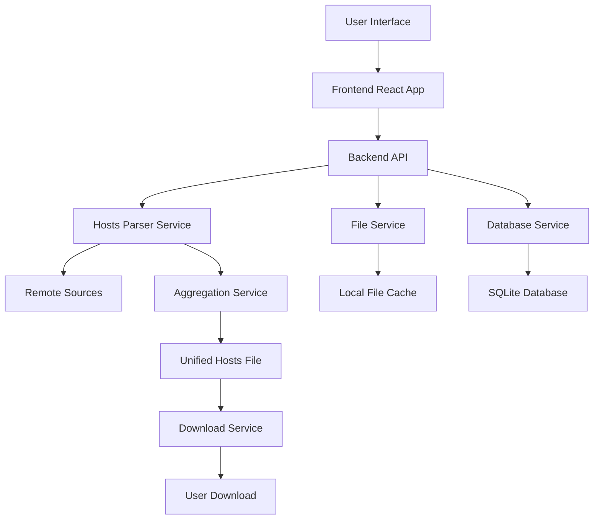
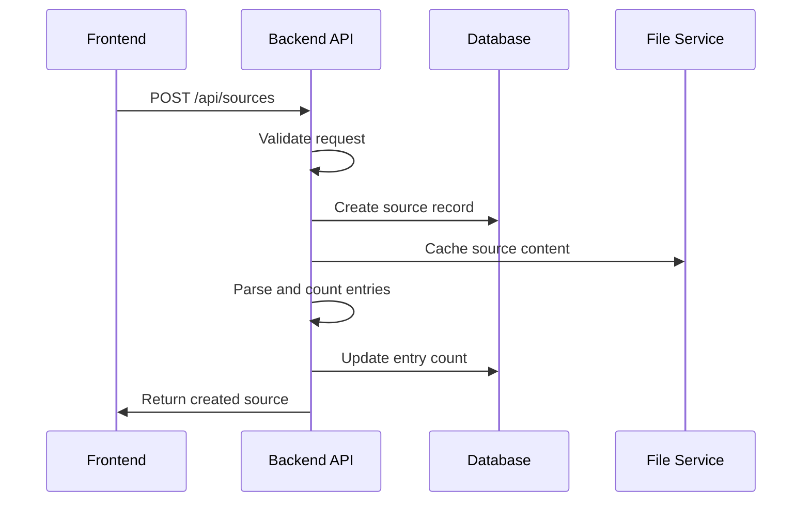
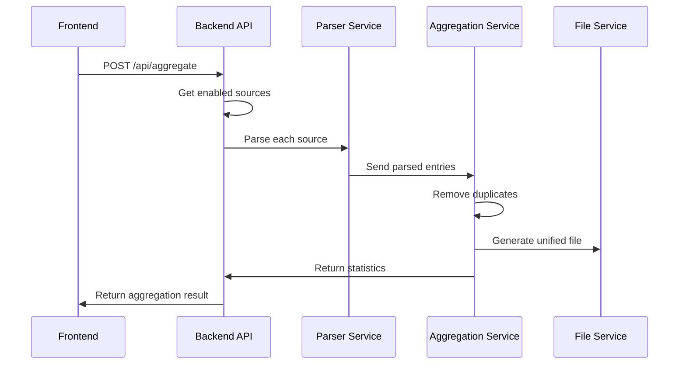
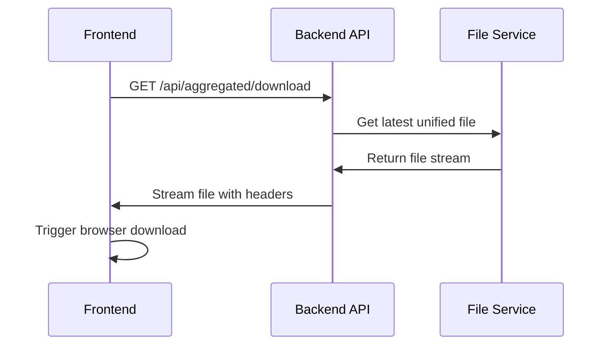

# Hosts Aggregator - Data Flow and Aggregation Logic

## Data Flow Overview

### System Architecture Flow



## Hosts File Parsing Logic

### Supported Formats

#### 1. Standard Hosts Format
```
# This is a comment
127.0.0.1 localhost
127.0.0.1 example.com
0.0.0.0 adserver.com
```

**Parsing Rules:**
- Lines starting with `#` are comments (ignored)
- Empty lines are ignored
- Valid lines contain IP address followed by domain(s)
- Multiple domains per line separated by spaces

#### 2. Adblock Plus Format
```
! This is a comment
||example.com^
||ads.example.com^
@@||good.example.com^
```

**Parsing Rules:**
- Lines starting with `!` are comments
- `||domain.com^` blocks entire domain
- `@@||domain.com^` whitelist exception
- Extract domain from pattern

#### 3. uBlock Origin Format
```
# This is a comment
example.com##.ad-banner
ads.example.com##.ad-container
```

**Parsing Rules:**
- Lines starting with `#` are comments
- `domain.com##selector` blocks elements
- Extract domain from pattern

### Parser Implementation

```typescript
interface ParsedEntry {
  domain: string;
  source: string;
  type: 'block' | 'allow' | 'element';
  comment?: string;
  lineNumber: number;
}

class HostsParser {
  parseStandardHosts(content: string, sourceId: string): ParsedEntry[] {
    const lines = content.split('\n');
    const entries: ParsedEntry[] = [];
    
    for (let i = 0; i < lines.length; i++) {
      const line = lines[i].trim();
      
      // Skip empty lines and comments
      if (!line || line.startsWith('#')) continue;
      
      // Parse IP and domains
      const parts = line.split(/\s+/);
      if (parts.length >= 2) {
        const ip = parts[0];
        const domains = parts.slice(1);
        
        for (const domain of domains) {
          if (this.isValidDomain(domain)) {
            entries.push({
              domain,
              source: sourceId,
              type: 'block',
              lineNumber: i + 1
            });
          }
        }
      }
    }
    
    return entries;
  }
  
  parseAdblock(content: string, sourceId: string): ParsedEntry[] {
    const lines = content.split('\n');
    const entries: ParsedEntry[] = [];
    
    for (let i = 0; i < lines.length; i++) {
      const line = lines[i].trim();
      
      // Skip empty lines and comments
      if (!line || line.startsWith('!')) continue;
      
      // Parse adblock patterns
      const domain = this.extractDomainFromAdblock(line);
      if (domain && this.isValidDomain(domain)) {
        const type = line.startsWith('@@') ? 'allow' : 'block';
        
        entries.push({
          domain,
          source: sourceId,
          type,
          lineNumber: i + 1
        });
      }
    }
    
    return entries;
  }
  
  private extractDomainFromAdblock(pattern: string): string | null {
    // Extract domain from ||domain.com^ patterns
    const match = pattern.match(/\|\|([^\^\/]+)/);
    return match ? match[1] : null;
  }
  
  private isValidDomain(domain: string): boolean {
    // Basic domain validation
    const domainRegex = /^[a-zA-Z0-9]([a-zA-Z0-9-]{0,61}[a-zA-Z0-9])?(\.[a-zA-Z0-9]([a-zA-Z0-9-]{0,61}[a-zA-Z0-9])?)*$/;
    return domainRegex.test(domain) && domain.length <= 253;
  }
}
```

## Aggregation Algorithm

### Core Aggregation Process

```typescript
interface AggregationResult {
  totalSources: number;
  totalEntries: number;
  uniqueEntries: number;
  duplicatesRemoved: number;
  blockedDomains: string[];
  allowedDomains: string[];
  processingTime: number;
}

class AggregationService {
  async aggregateSources(sources: HostsSource[]): Promise<AggregationResult> {
    const startTime = Date.now();
    const allEntries: ParsedEntry[] = [];
    
    // Fetch and parse all enabled sources
    for (const source of sources.filter(s => s.enabled)) {
      try {
        const content = await this.fetchSourceContent(source);
        const entries = this.parseSourceContent(content, source.id);
        allEntries.push(...entries);
      } catch (error) {
        console.error(`Failed to process source ${source.id}:`, error);
      }
    }
    
    // Remove duplicates and apply allow rules
    const result = this.processEntries(allEntries);
    
    // Generate unified hosts file
    await this.generateUnifiedFile(result.blockedDomains);
    
    return {
      totalSources: sources.filter(s => s.enabled).length,
      totalEntries: allEntries.length,
      uniqueEntries: result.blockedDomains.length,
      duplicatesRemoved: allEntries.length - result.blockedDomains.length,
      blockedDomains: result.blockedDomains,
      allowedDomains: result.allowedDomains,
      processingTime: Date.now() - startTime
    };
  }
  
  private processEntries(entries: ParsedEntry[]): {
    blockedDomains: string[];
    allowedDomains: string[];
  } {
    const blocked = new Set<string>();
    const allowed = new Set<string>();
    
    // First pass: collect allow rules
    for (const entry of entries) {
      if (entry.type === 'allow') {
        allowed.add(entry.domain);
      }
    }
    
    // Second pass: collect block rules (excluding allowed domains)
    for (const entry of entries) {
      if (entry.type === 'block' && !allowed.has(entry.domain)) {
        blocked.add(entry.domain);
      }
    }
    
    return {
      blockedDomains: Array.from(blocked).sort(),
      allowedDomains: Array.from(allowed).sort()
    };
  }
}
```

### Performance Optimization

#### Memory-Efficient Processing
```typescript
class StreamAggregationService {
  async aggregateLargeSources(sources: HostsSource[]): Promise<AggregationResult> {
    const blocked = new Set<string>();
    const allowed = new Set<string>();
    let totalEntries = 0;
    
    for (const source of sources) {
      const stream = await this.createSourceStream(source);
      
      for await (const entry of stream) {
        totalEntries++;
        
        if (entry.type === 'allow') {
          allowed.add(entry.domain);
          blocked.delete(entry.domain); // Remove if previously blocked
        } else if (entry.type === 'block' && !allowed.has(entry.domain)) {
          blocked.add(entry.domain);
        }
      }
    }
    
    return {
      totalSources: sources.length,
      totalEntries,
      uniqueEntries: blocked.size,
      duplicatesRemoved: totalEntries - blocked.size,
      blockedDomains: Array.from(blocked),
      allowedDomains: Array.from(allowed),
      processingTime: 0 // Calculate actual time
    };
  }
  
  private async *createSourceStream(source: HostsSource): AsyncGenerator<ParsedEntry> {
    // Implement streaming parser for large files
    // Process file line by line to avoid memory issues
  }
}
```

## API Data Flow

### Frontend to Backend Communication

#### 1. Source Management Flow


#### 2. Aggregation Flow


#### 3. Download Flow


### Real-time Updates

#### WebSocket Integration (Optional)
```typescript
// For real-time aggregation progress
interface AggregationProgress {
  sourceId: string;
  status: 'fetching' | 'parsing' | 'complete' | 'error';
  progress: number;
  entriesProcessed: number;
}

class AggregationProgressService {
  private clients = new Map<string, WebSocket>();
  
  broadcastProgress(progress: AggregationProgress) {
    this.clients.forEach((client, id) => {
      if (client.readyState === WebSocket.OPEN) {
        client.send(JSON.stringify({
          type: 'aggregation-progress',
          data: progress
        }));
      }
    });
  }
}
```

## Error Handling and Recovery

### Source Processing Errors
```typescript
interface SourceProcessingResult {
  sourceId: string;
  success: boolean;
  entriesProcessed?: number;
  error?: {
    type: 'network' | 'parse' | 'format';
    message: string;
    details?: any;
  };
}

class ErrorHandlingService {
  async processSourceWithRetry(source: HostsSource): Promise<SourceProcessingResult> {
    const maxRetries = 3;
    
    for (let attempt = 1; attempt <= maxRetries; attempt++) {
      try {
        const content = await this.fetchSourceContent(source);
        const entries = this.parseSourceContent(content, source.id);
        
        return {
          sourceId: source.id,
          success: true,
          entriesProcessed: entries.length
        };
      } catch (error) {
        if (attempt === maxRetries) {
          return {
            sourceId: source.id,
            success: false,
            error: this.classifyError(error)
          };
        }
        
        // Exponential backoff
        await this.delay(Math.pow(2, attempt) * 1000);
      }
    }
    
    return {
      sourceId: source.id,
      success: false,
      error: { type: 'network', message: 'Max retries exceeded' }
    };
  }
  
  private classifyError(error: any): { type: string; message: string } {
    if (error.code === 'ENOTFOUND') {
      return { type: 'network', message: 'DNS lookup failed' };
    } else if (error.response?.status === 404) {
      return { type: 'network', message: 'Source not found' };
    } else if (error instanceof SyntaxError) {
      return { type: 'parse', message: 'Invalid file format' };
    } else {
      return { type: 'unknown', message: error.message };
    }
  }
}
```

## Data Validation and Sanitization

### Input Validation
```typescript
class ValidationService {
  validateSourceUrl(url: string): ValidationResult {
    try {
      const parsed = new URL(url);
      
      // Allow only HTTP/HTTPS
      if (!['http:', 'https:'].includes(parsed.protocol)) {
        return { valid: false, error: 'Only HTTP/HTTPS URLs are allowed' };
      }
      
      // Validate domain
      if (!this.isValidDomain(parsed.hostname)) {
        return { valid: false, error: 'Invalid domain name' };
      }
      
      return { valid: true };
    } catch {
      return { valid: false, error: 'Invalid URL format' };
    }
  }
  
  validateFileUpload(file: Express.Multer.File): ValidationResult {
    const maxSize = 10 * 1024 * 1024; // 10MB
    const allowedTypes = ['text/plain', 'application/octet-stream'];
    
    if (file.size > maxSize) {
      return { valid: false, error: 'File too large' };
    }
    
    if (!allowedTypes.includes(file.mimetype)) {
      return { valid: false, error: 'Invalid file type' };
    }
    
    return { valid: true };
  }
}
```

## Caching Strategy

### Source Content Caching
```typescript
class CacheService {
  private cache = new Map<string, { content: string; timestamp: number }>();
  private readonly TTL = 60 * 60 * 1000; // 1 hour
  
  async getCachedContent(sourceId: string): Promise<string | null> {
    const cached = this.cache.get(sourceId);
    
    if (cached && Date.now() - cached.timestamp < this.TTL) {
      return cached.content;
    }
    
    return null;
  }
  
  async setCachedContent(sourceId: string, content: string): Promise<void> {
    this.cache.set(sourceId, {
      content,
      timestamp: Date.now()
    });
  }
  
  async invalidateCache(sourceId: string): Promise<void> {
    this.cache.delete(sourceId);
  }
}
```

### Aggregation Result Caching
```typescript
class AggregationCacheService {
  private latestResult: AggregationResult | null = null;
  private lastAggregationTime: number = 0;
  private readonly CACHE_DURATION = 5 * 60 * 1000; // 5 minutes
  
  getCachedResult(): AggregationResult | null {
    if (this.latestResult && 
        Date.now() - this.lastAggregationTime < this.CACHE_DURATION) {
      return this.latestResult;
    }
    return null;
  }
  
  setCachedResult(result: AggregationResult): void {
    this.latestResult = result;
    this.lastAggregationTime = Date.now();
  }
}
```

## Performance Monitoring

### Aggregation Metrics
```typescript
interface AggregationMetrics {
  startTime: number;
  endTime: number;
  sourcesProcessed: number;
  totalEntries: number;
  memoryUsage: number;
  processingTimePerSource: Record<string, number>;
  errors: SourceProcessingResult[];
}

class MetricsService {
  private metrics: AggregationMetrics[] = [];
  
  recordAggregation(metrics: AggregationMetrics): void {
    this.metrics.push(metrics);
    
    // Keep only last 100 records
    if (this.metrics.length > 100) {
      this.metrics.shift();
    }
  }
  
  getPerformanceStats(): {
    averageProcessingTime: number;
    successRate: number;
    averageEntriesPerSource: number;
  } {
    if (this.metrics.length === 0) {
      return { averageProcessingTime: 0, successRate: 0, averageEntriesPerSource: 0 };
    }
    
    const totalTime = this.metrics.reduce((sum, m) => 
      sum + (m.endTime - m.startTime), 0);
    const totalSources = this.metrics.reduce((sum, m) => 
      sum + m.sourcesProcessed, 0);
    const totalEntries = this.metrics.reduce((sum, m) => 
      sum + m.totalEntries, 0);
    const totalErrors = this.metrics.reduce((sum, m) => 
      sum + m.errors.length, 0);
    
    return {
      averageProcessingTime: totalTime / this.metrics.length,
      successRate: 1 - (totalErrors / totalSources),
      averageEntriesPerSource: totalEntries / totalSources
    };
  }
}
```

This comprehensive data flow and aggregation logic provides a solid foundation for the hosts aggregation system, with proper error handling, performance optimization, and monitoring capabilities.